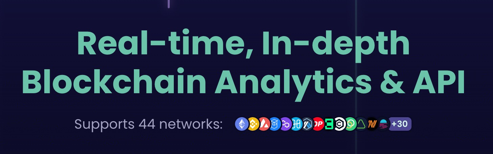

# Defined.fi Realtime Websocket SDK

TypeScript library for interacting with [Defined.fi](https://defined.fi)'s realtime websockets.



This library is isomorphic, working on both client and server. Client uses the built-in browser WebSocket, and server will default to the [`ws`](https://github.com/websockets/ws) package.

## Installation

defined-realtime-websocket can be used both client-side and server-side.

To install defined-realtime-websocket, use:

```bash
npm install defined-realtime-websocket
# or yarn add defined-realtime-websocket
# or pnpm i defined-realtime-websocke
```

## Usage

> If you’re new to Defined.fi's API, or need an API key, checkout [their docs to get started](https://docs.defined.fi/)

### Configuration

Import and instantiate the client with your defined API key. If you don't have an API key, you can request one in Defined.fi's Discord

```ts
import { DefinedRealtimeClient } from 'defined-realtime-websocket';

const DEFINED_API_KEY = '1234...7890';

const definedWs = new DefinedRealtimeClient(MY_DEFINED_API_KEY);
```

That's it for set up.

Now let's subscribe to a realtime update of some kind.

First we'll need an subscription handler to handle incoming websocket messages and updates. A subscription handler is just a JavaScript object with three functions attached to it: `next(nextVal => void)`, `error(err => void)`, and `complete(() => void)`. This is based off the Apollo and other GraphQL subscription event sink patterns.

```tsx
const subscriptionHandler = {
  next: (nextVal) {
    // Save the incoming websocket data somewhere in your application
  },
  error: (err) {
    // Handle a websocket error in your application
  },
  complete: () {
    // The subscription is done/complete and there will be no more events sent.
  }
}
```

## Available Subscriptions

### `subscribeToTokenPriceUpdates`

Latest price data.

```tsx
const unsub = definedWs.subscribeToTokenPriceUpdates(
  subscriptionHandler,
  // Optional filter object
  {
    contractAddress: '0x1234...',
    chainId: 1,
  }
);
```

### `subscribeToTokenChartUpdates`

Data you need to update your charts. (Supports TradingView format output).

```tsx
const unsub = definedWs.subscribeToTokenChartUpdates(
  subscriptionHandler,
  // Optional filter object
  {
    contractAddress: '0x1234...',
    chainId: 1,
  }
);
```

### `subscribeToTokenSwapUpdates`

Latest transaction events.

```tsx
const unsub = definedWs.subscribeToTokenSwapUpdates(
  subscriptionHandler,
  // Optional filter object
  {
    contractAddress: '0x1234...',
    chainId: 1,
  }
);
```

### `subscribeToNftSales`

Latest nft transaction events.

```tsx
const unsub = definedWs.subscribeToNftSales(
  subscriptionHandler,
  // Optional filter object
  {
    contractAddress: '0x1234...',
    chainId: 1,
  }
);
```

### `subscribe`

If the pre-built subscriptions don't work, you can always use own custom GQL.

Create your own GQL subscription.

```tsx
// Custom GQL for $LINK mainnet price updates
const customGql = `
subscription UpdatePrice($address: String, $networkId: Int) {
  onUpdatePrice(address: "0x514910771af9ca656af840dff83e8264ecf986ca", networkId: 1) {
    address
    networkId
    priceUsd
    timestamp
  }
}`;

// Add the typing
interface TokenPricingGqlData {
  onUpdatePrice: {
    timestamp: number;
    priceUsd: number;
    networkId: number;
    address: string;
  };
}

// Subscribe to the custom GQL and add in the type for full type-safety
const unsub = definedWs.subscribe<TokenPricingGqlData>(
  customGql,
  subscriptionHandler
);
```

## Full example

Let's get all realtime trades for the Milady NFT collection.

```tsx
import { DefinedRealtimeClient } from 'defined-realtime-websocket';

const definedWs = new DefinedRealtimeClient(API_KEY);

await definedWs.subscribeToNftSales(
  // Filter (optional)
  {
    // Milady
    contractAddress: '0x5af0d9827e0c53e4799bb226655a1de152a425a5',
    // Mainnet
    chainId: 1,
  },
  // Subscription handle / event sink
  {
    next(nftTxData) {
      console.log(nftTxData.onCreateNftEvents.address)
    },
    error(_) {
      // noop
    },
    complete: () {
      // noop
    },
  }
);

```

## License

MIT. Do whatever.

## Contributing

Gladly accept PRs and feedback via GitHub.
